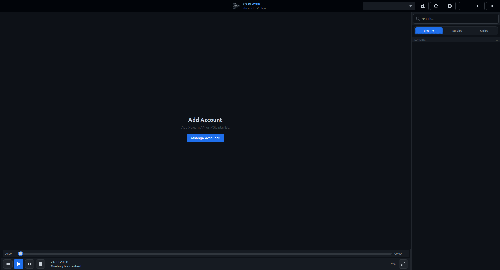
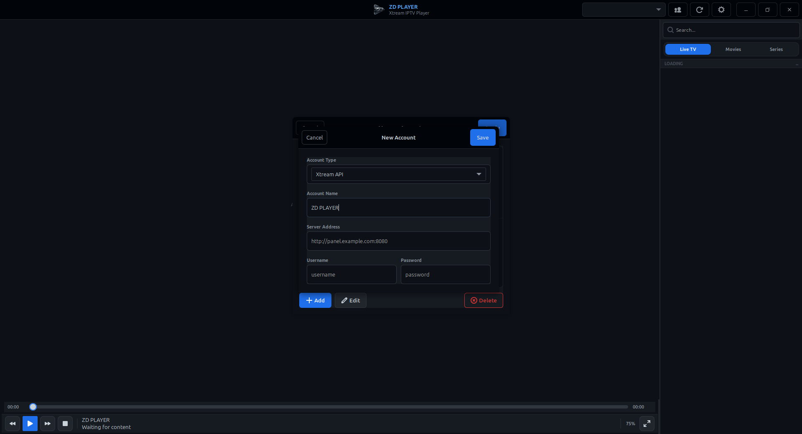

# ZD PLAYER

Linux Mint icin yerel bir Xtream API IPTV oynaticisi.

## Ozellikler

- Birden fazla Xtream hesabi ekleme, duzenleme ve silme
- Hesaplari JSON olarak yerelde saklama
- `Canli TV`, `Filmler` ve `Diziler` sekmeleri
- Her icerik turu icin kategori filtreleme ve arama
- Dizilerde sezon ve bolum listeleme
- GStreamer ile uygulama icinde oynatma
- Modern kontrol cubugu: oynat/duraklat, durdur, tam ekran
- Sag tik menusu ile ses izi ve altyazi secimi
- Mouse tekerlek ile ses seviyesi ayarlama
- Cift tiklama ile tam ekran gecisi
- Video tam ekranda: kontroller otomatik gizlenme
- Esc / F11 ile tam ekrandan cikis

## Calistirma

```bash
git clone https://github.com/ZaferBey95/ZD-PLAYER.git
cd ZD-PLAYER
./run.sh
```

Alternatif:

```bash
PYTHONPATH=src python3 -m zdplayer
```

## Mimari

```
src/zdplayer/
  models.py      - Hesap, kategori, katalog, dizi ve profil modelleri
  storage.py     - Hesaplarin yerel kaliciligi
  xtream.py      - Xtream API istemcisi
  app.py         - Uygulama giris noktasi
  ui/
    __init__.py  - Paket exportlari
    css.py       - Modern GTK3 temasi
    helpers.py   - Yardimci fonksiyonlar
    dialogs.py   - Hesap ekleme/duzenleme dialoglari
    sidebar.py   - Hesap ozeti, icerik tipi secici, kategori listesi
    browser.py   - Arama ve icerik listesi
    player.py    - GStreamer video oynatici ve kontroller
    detail.py    - Secili icerik detaylari ve dizi paneli
    window.py    - Ana pencere (orkestrator)
```

## Notlar

- Hesap bilgileri `~/.local/share/zdplayer/state.json` altinda tutulur.
- Canli TV cikisi icin bazi saglayicilar `m3u8`, bazilari `ts` ister.
- Ses ve altyazi secimi, akista ilgili track bilgisi varsa sag tik menusuyle yapilir.
- Video uzerinde mouse tekerlek ile ses seviyesi ayarlanir.

## Ekran Goruntuleri

### Ana Ekran



### Oynatici


